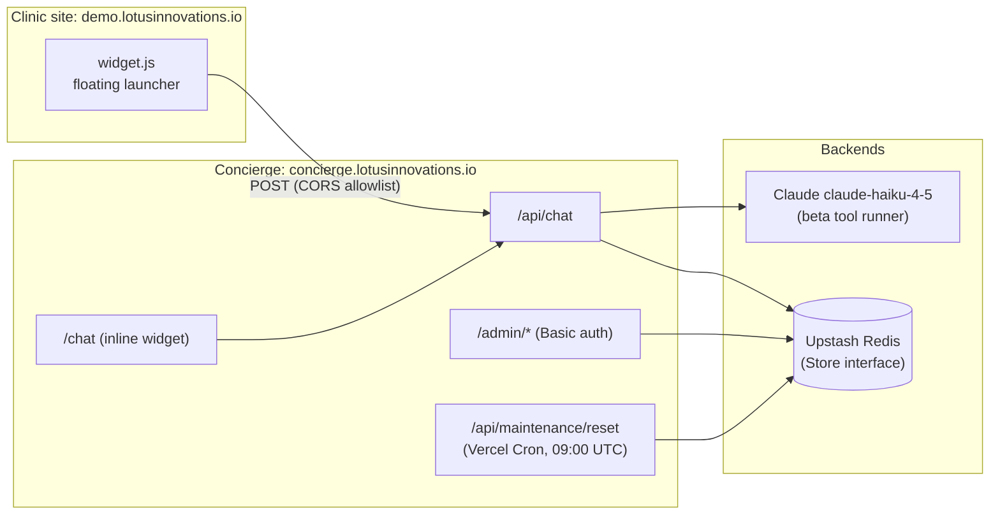
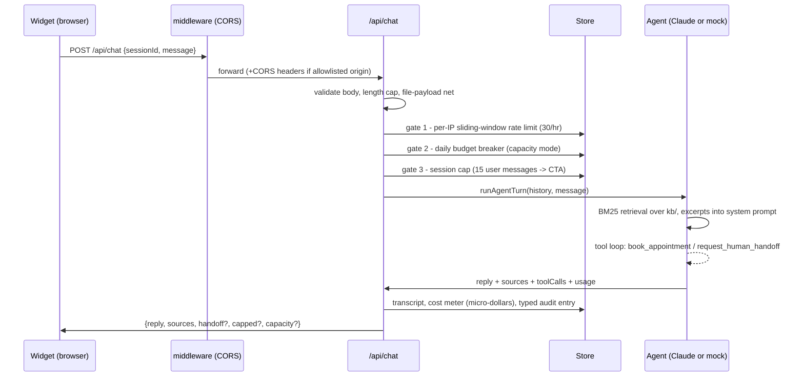
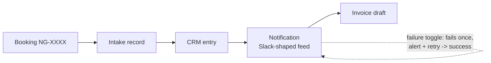

# Architecture: Novagait AI Concierge

Demonstration project by Lotus Innovations (spec 01 of the bd-37 demo
suite). "Novagait" is a fictional brand; all data is synthetic. This doc
describes the system as shipped in v1.0.0.

## System overview

One Next.js deployment on Vercel serves every surface. It uses the App Router
with TypeScript strict mode. The surfaces are the embeddable widget bundle,
the standalone chat page, the JSON API, and the server-rendered admin panel.

- **Widget** (`widget/src`): one vanilla-TypeScript bundle, built by esbuild
  to `public/widget.js` (~15 kB IIFE, no framework). It renders into a
  shadow root, so host-page CSS and widget CSS cannot interact. The same
  bundle runs in two modes. `floating` gives a launcher and dialog, used on
  the clinic site and the concierge landing page. `inline` fills a container,
  and `/chat` uses it. Cross-origin embeds are allowlisted by
  `src/middleware.ts` + `src/lib/cors.ts` (default:
  `https://demo.lotusinnovations.io`).
- **Agent** (`src/agent/`) holds a versioned system prompt
  (`system-prompt.ts`) and tool schemas (`tools.ts`). It runs BM25 retrieval
  over `kb/` markdown (`retrieval.ts`). The turn loop (`agent.ts`) runs Claude
  `claude-haiku-4-5` through the SDK's beta tool runner.
- **Store** (`src/lib/store.ts`) is a small `Store` interface with two
  drivers. Upstash Redis runs in production, and an in-memory driver covers
  dev, CI and e2e. All state is ephemeral demo data, and a nightly cron
  reseeds it.
- **Admin** (`src/app/admin/`): server-rendered semantic HTML views (no
  client JS) behind HTTP Basic auth, reading the same store.

## A chat turn, end to end

Every gate that trips writes a typed `containment.*` audit entry instead of a
raw error. The widget renders each state as a friendly notice. Those are
the budget breaker's "capacity mode", the session-cap walkthrough, and the
rate-limit pause.

## Booking automation chain

`book_appointment` (executor in `src/lib/bookings.ts`) writes the booking
and drives a visible four-step pipeline with attempt-level history:

The demo failure toggle arms a one-shot failure of the notification step. It
is `POST /api/admin/failure-toggle`, with Bearer `ADMIN_PASSWORD`. The stepper
shows an error state and an alert, the retry succeeds, and the toggle
auto-disarms. This error->retry->success sequence is scripted into the
automation demo video.

## Mock mode (key-free lanes)

`MOCK_AGENT=1`, or an absent key, replaces the model call with a
deterministic turn. **The tool executors are still the real ones.** Scripted
trigger phrases exercise the same store writes production uses:

| Trigger in message              | Effect                                         |
| ------------------------------- | ---------------------------------------------- |
| "human", "person", "front desk" | real handoff executor -> Front Desk queue      |
| "book"                          | real booking executor -> full automation chain |
| anything else                   | retrieval-grounded canned reply with citation  |

CI never sees an API key. Unit tests run on Vitest against the in-memory
store. The Playwright e2e lane runs a production build with `MOCK_AGENT=1`.
Both are key-free by design. Model-in-the-loop evidence is produced locally and committed
under `docs/evidence/`.

## Containment layers (spec 01 §6)

| Layer             | Mechanism                                                              |
| ----------------- | ---------------------------------------------------------------------- |
| API key           | Dedicated hard-capped key, Vercel prod env only                        |
| Model             | `claude-haiku-4-5` (cheapest current tier)                             |
| Rate limit        | Two-bucket sliding window per IP, 30 msgs/hour                         |
| Budget breaker    | Micro-dollar cost meter per day vs `DAILY_BUDGET_USD`; "capacity" mode |
| Session cap       | 15 user messages, then walkthrough CTA                                 |
| Input limits      | 1000-char cap + file-looking payload refusal                           |
| Injection posture | KB excerpts are the only trusted content; user text never re-instructs |

## Accessibility (spec 01 §8)

The widget is fully keyboard operable. The launcher opens a dialog with a
focus trap, Escape closes it, and focus is restored. New messages are
announced through a polite live region (`role="log"`). The widget respects
`prefers-reduced-motion`, and keeps AA contrast in both themes with 44px
minimum targets. It goes full-screen at small viewports, which is also what
400% zoom produces.

The e2e suite enforces axe **0 WCAG A/AA violations** on every CI run. It
covers all three surfaces: the widget page, the standalone page, and all
admin views.

## Deploy topology

- Push to `main` -> GitHub App -> Vercel production build
  (`prebuild` bundles the widget) -> concierge.lotusinnovations.io.
- PRs get preview deploys with `MOCK_AGENT=1`, so no key and no spend.
- Nightly Vercel Cron resets demo state via `/api/maintenance/reset`
  (Bearer `CRON_SECRET`), reseeding three bookings.
